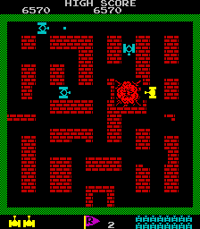

# djog_unos_2020

DJOG Uno's 2020-2021.

## Goal

 * Re-create Tank Battalion
 * Learn how to program using Processing
 * Learn how to work with `git` en GitHub
 * Practice in teamwork

## Sprites

## Screenshots

Most recent at the top.

## Links

 * [git voor jonge tieners](https://github.com/richelbilderbeek/git_voor_jonge_tieners)
 * [djog.github.io/help](https://djog.github.io/help/)
 * [Tank Battalion Wikipedia page](https://en.wikipedia.org/wiki/Tank_Battalion)
 * [YouTube video](https://youtu.be/vNNPbVpZutw)
 * [Play the game online](https://www.retrogames.cc/msx1-games/tank-battalion.html)

