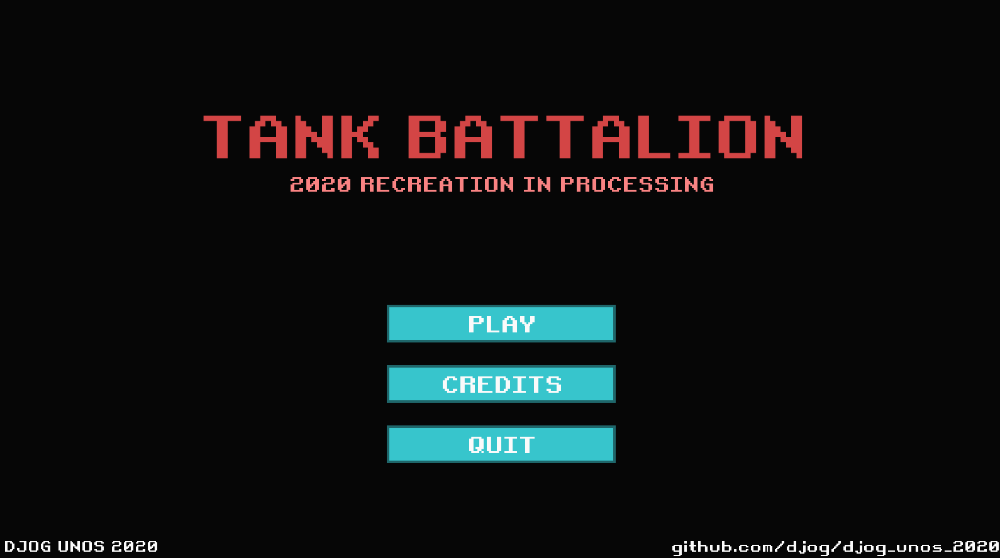
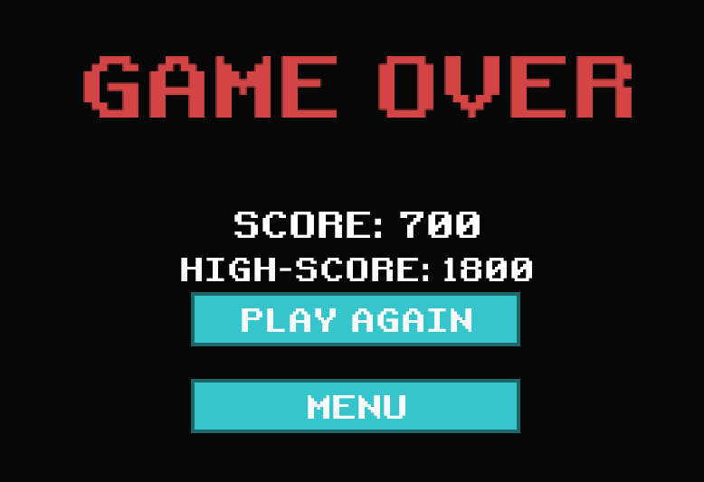

# Tank Battalion

A recreation of the arcade game Tank Battalion by the DJOG Uno's 2020 team in processing.

## Download

- [**Windows (64-bit)**](https://drive.google.com/file/d/15mamrIVURvDZWZ9cmPaCihfxW2cZGMN7)

- [**Linux (64-bit)**](https://drive.google.com/file/d/1iA8HHxbwiic3z7kysODHYwkHkqVHDSZg)

Unzip the archive and run the executable to play!
Make sure you've a JRE installed if you're using Linux.

## Screenshots

## Goals

- [x] Re-created Tank Battalion
- [x] Learned how to program using Processing
- [x] Learned how to work with Git & GitHub
- [x] Practiced with teamwork

## Code of Conduct

See: [CODE_OF_CONDUCT.md](CODE_OF_CONDUCT.md).

In case it is undesirable to email Richel Bilderbeek,
contact Carleen Baarda, the director of DJO.

## Other links

* [Git Help](https://djog.github.io/help/)
* [Git voor jonge tieners](https://github.com/richelbilderbeek/git_voor_jonge_tieners)
* [Tank Battalion Wikipedia page](https://en.wikipedia.org/wiki/Tank_Battalion)
* [YouTube video of original game](https://youtu.be/vNNPbVpZutw)
* [Play the original game (online emulator)](https://www.retrogames.cc/msx1-games/tank-battalion.html)